# Product Requirements Document (PRD)

## Project Name: Chitai Soft Automation Corporate Website
* **Domain:** [chitaisoftautomation.in](https://chitaisoftautomation.in)
* **Company:** Chitai Soft Automation
* **Version:** 1.0.0
* **Date:** October 2026
* **Status:** Approved / In Development

---

## 1. Executive Summary & Objective

**Chitai Soft Automation** is an industrial automation and engineering solutions provider delivering reliable control systems, PLC & SCADA integration, and Industrial IoT across India.

### 1.1 Objective
Design and develop a high-performance, responsive corporate website that:
1. Establishes a credible, engineering-grade online presence matching the company's brand identity.
2. Showcases core engineering capabilities (PLC, SCADA, HMI, Control Panels, IIoT).
3. Highlights key vertical expertise in **Power & Energy, Oil & Gas, and Water & Wastewater**.
4. Features required OEM automation partner platforms: **Emerson, Renu, Delta, and Schneider Electric**.
5. Drives qualified project inquiries and consultation requests via high-conversion inquiry forms.

---

## 2. Brand Identity & Visual Guidelines

* **Primary Tagline:** *AUTOMATION | CONTROL | IoT*
* **Mission Statement:** *Smart Automation for a Better Tomorrow*
* **Brand Positioning:** *Your Automation Partner* — Engineering-grade automation solutions engineered for precision, reliability, and maximum uptime.
* **Core Values:** *Reliable | Innovative | Customized Solutions*
* **Design Aesthetic:**
  * **Color Theme:** Industrial Royal Blue & Deep Navy (`#082752`, `#0B3C83`, `#0F4C81`), Crisp White (`#FFFFFF`), High-Contrast Cyan & Electric Blue accents (`#00A8FF`, `#00D2D3`), Subtle Neutral Grays (`#F4F7FA`, `#E2E8F0`, `#64748B`).
  * **Visual Style:** Clean industrial precision aesthetic, technical corner-bracket accents (`┌ ┐ └ ┘`), subtle circuit/grid background patterns, professional typography (Inter / Plus Jakarta Sans).
  * **Official Logo:** Distinctive "CS" monogram with lightning bolt / electrical spark design in deep blue & cyan.

---

## 3. Information Architecture & Navigation

The website consists of 5 primary pages structured for clear user navigation:

```mermaid
graph TD
    A[Global Header / Navigation] --> B[1. Home Page]
    A --> C[2. Products & Services]
    A --> D[3. Industries]
    A --> E[4. About Us]
    A --> F[5. Contact Us]
    A --> G[CTA: Get a Quote / Consultation]

    B --> B1[Hero: Precision Automation]
    B --> B2[Core Pillars & Capabilities]
    B --> B3[End-to-End Engineering]
    B --> B4[Industries Showcase]
    B --> B5[Quick Plant Inquiry Form]

    C --> C1[Control Panels: Design, Build, Install]
    C --> C2[PLC & SCADA Systems]
    C --> C3[Supported Brands: Emerson, Renu, Delta, Schneider]
    C --> C4[Industrial IoT & Industry 4.0]
    C --> C5[Engineering Delivery Lifecycle]

    D --> D1[Oil & Gas Applications]
    D --> D2[Power & Energy Systems]
    D --> D3[Water & Wastewater Treatment]
    D --> D4[Discrete & Process Manufacturing]

    E --> E1[Founding Story & Engineering Roots]
    E --> E2[4 Core Values: Rigour, Site-First, Independent, Support]
    E --> E3[6 Technical Core Capabilities]
    E --> E4[Geographic Reach: UP HQ + Pan-India]

    F --> F1[Direct Contact Details]
    F --> F2[Service Inquiry & RFQ Form]
    F --> F3[SLA: 24-Hour Technical Response]
```

---

## 4. Detailed Functional Page Specifications

### 4.1 Home Page (`/index.html`)

* **Hero Section:**
  * Eyebrow: `INDUSTRIAL AUTOMATION • PAN-INDIA`
  * Primary Headline: **"Precision Automation. Intelligent Control."**
  * Sub-headline: *"PLC & SCADA systems and Industrial IoT solutions engineered for power generation and oil & gas operators across India and beyond."*
  * CTAs:
    * Primary CTA: `Request a Consultation →` (scrolls to enquiry / redirects to contact)
    * Secondary CTA: `View Services`
* **Core Offerings Snapshot:**
  * Control Panel (Design | Build | Install)
  * PLC (Automation & Control)
  * HMI (Better Visibility)
  * SCADA (Real-time Monitoring)
  * IoT Solutions (Connected Future)
* **Engineering Overview (End-to-End Automation):**
  * Card 1: `CONTROL ARCHITECTURE` — PLC & SCADA Systems (multi-vendor support, real-time dashboards, alarm management, remote access).
  * Card 2: `INDUSTRY 4.0` — Industrial IoT & Smart Manufacturing (edge computing, OEE & downtime analytics, predictive maintenance).
* **Industries Showcase:**
  * Primary Focus: Power & Oil and Gas (Turbine & generator control, pipeline & process automation, IEC 61511 / IEC 61508 compliant Safety Instrumented Systems).
  * Secondary Focus: Chemical Processing & Packaging/Logistics.
* **Direct Inquiry Form:**
  * Clean card with: Full Name, Company, Phone Number, Project Brief, and `Submit Enquiry →` action.
  * Turnaround SLA banner: *"Typical response within 24 hours."*
* **Global Footer:**
  * Company summary, HQ address (India), Contact phone & email, quick links, copyright, and value proposition statement.

---

### 4.2 Products & Services Page (`/services.html`)

* **Page Header:**
  * Eyebrow: `WHAT WE DO`
  * Title: **"Our Services & Supported Systems"**
  * Subtitle: *"End-to-end automation engineering — from control architecture design through commissioning, integration, and ongoing support."*
* **MANDATORY OEM Brands & Platforms Showcase:**
  * The product/platform section must prominently highlight expertise in:
    1. **Emerson:** DeltaV DCS, Ovation, PACSystems PLCs, Rosemount instrumentation.
    2. **Renu Electronics:** FlexiPanels HMI+PLC combo units, industrial touchscreens, protocol gateways.
    3. **Delta:** DVP Series PLCs, DOP HMIs, VFDs (Variable Frequency Drives), servos, automation modules.
    4. **Schneider Electric:** Modicon M221/M241/M251/M580 PLCs, EcoStruxure software, Magelis HMI, Altivar drives.
* **Core Service Modules:**
  1. **Control Panel Engineering:** Design, custom fabrication, wiring, FAT (Factory Acceptance Testing), on-site installation.
  2. **PLC Programming & Commissioning:** Ladder logic, FBD, structured text, I/O mapping across multi-vendor architectures.
  3. **SCADA & HMI Development:** Custom graphical HMIs, real-time dynamic graphics, alarm prioritization, audit logging, historian integration.
  4. **Historian & Data Integration:** OPC-UA, Modbus TCP/RTU, plant-level SQL database bridges.
  5. **Remote Diagnostics & Support:** Secure VPN/cellular industrial router setup for 24/7 telemetry and off-site fault resolution.
* **Industrial IoT & Smart Manufacturing (Key Metrics):**
  * Edge computing & gateway setup.
  * OEE & real-time downtime analytics.
  * Predictive vibration & temperature anomaly monitoring.
  * **Proven Impact Metrics:**
    * **↓ 30%** Unplanned Downtime
    * **↑ 15%** OEE Improvement
    * **0** Rip-and-replace required (edge-first integration with existing PLCs)
* **Our 4-Step Delivery Process:**
  * `01. Requirements & Architecture` → `02. Development & Configuration` → `03. Installation & Testing (FAT/SAT)` → `04. Handover & Ongoing Support`.

---

### 4.3 Industries Page (`/industries.html`)

* **Page Header:**
  * Eyebrow: `SECTORS WE EMPOWER`
  * Title: **"Industries We Serve"**
  * Subtitle: *"From oil & gas facilities to power generation plants, we engineer automation solutions built around the specific demands of your industry."*
* **Detailed Industry Vertical Breakdowns:**
  1. **Oil & Gas Operations:**
     * Upstream wellhead & separator automation.
     * Midstream pipeline monitoring, pressure regulation & leak detection.
     * Downstream refinery & distribution pump stations.
     * SIL-rated Safety Instrumented Systems (SIS), Emergency Shutdown (ESD), Fire & Gas (F&G) detection.
  2. **Power Generation & Energy Distribution:**
     * Turbine & generator auxiliary control.
     * Substation automation & IEC 61850 protocol integration.
     * Boiler & heat recovery steam generator (HRSG) instrumentation.
     * High-reliability redundant PLC architectures.
  3. **Water & Wastewater Treatment:**
     * Automated chemical dosing, filtration, and aeration control.
     * Remote pump & lift station automation (duty/standby cycling, level telemetry).
     * SCADA for regional distribution networks & reservoirs.
     * Energy optimization with Variable Frequency Drives (VFDs).
  4. **Chemical, Manufacturing & Process Industries:**
     * Continuous and batch process automation (ISA-88).
     * High-speed packaging, vision inspection & sorting.
* **Custom Sector CTA Callout:**
  * *"Working in a Different Industry? We work across a wide range of process and discrete manufacturing sectors. Get in touch to discuss your specific automation requirements."*

---

### 4.4 About Us Page (`/about.html`)

* **Hero & Our Story:**
  * Title: **"About Chitai Soft Automation"**
  * Subtitle: *"An automation engineering company delivering reliable industrial control systems across India."*
  * Story Narrative: Founded to bring dependable, rigorous engineering to Indian industry. Grounded in plant floor realities with hands-on site experience.
* **4 Engineering Principles & Values:**
  1. **Technical Rigour:** Systems designed strictly to specification, thoroughly tested (FAT/SAT), with comprehensive schematics and documentation.
  2. **Site-First Thinking:** Pragmatic engineering designed for the realities of tough industrial plant environments.
  3. **Vendor Independence:** Unbiased platform selection (Emerson, Schneider, Delta, Renu, etc.) based on process needs rather than vendor exclusivity.
  4. **Long-Term Support:** Committed post-commissioning support, lifecycle maintenance, and fast response times.
* **6 Core Technical Capabilities:**
  * 01: PLC & Control Systems
  * 02: SCADA & HMI Development
  * 03: Industrial IoT
  * 04: Historian & Data Integration
  * 05: Remote Diagnostics
  * 06: Project Engineering (End-to-end FDS to SAT)
* **Geographical Presence & Service Reach:**
  * **Headquarters:** India
  * **Project Coverage:** Pan-India on-site commissioning & deployment
  * **Response Time:** Guaranteed initial response within 24 hours

---

### 4.5 Contact Us Page (`/contact.html`)

* **Direct Contact Cards:**
  * **Office Address:** Chitai Soft Automation, India
  * **Phone:** `+91 9021682318`
  * **Email:** `chitaisoft@gmail.com` / `info@chitaisoftautomation.in`
  * **Working Hours:** Monday – Saturday, 9:00 AM – 6:00 PM IST
  * **Response SLA:** Within 24 hours
* **Interactive RFQ / Technical Inquiry Form:**
  * Fields:
    * `Full Name` *(Required)*
    * `Work Email` *(Required)*
    * `Company / Organization` *(Required)*
    * `Phone Number` *(Required)*
    * `Service of Interest` *(Dropdown: PLC & SCADA Systems, Control Panel Design, Industrial IoT, Brand Specific Integration [Emerson/Renu/Delta/Schneider], Other)*
    * `Project Brief & Requirements` *(Textarea, Required)*
  * Client-side validation, instant feedback modal/toast, and clear submission states.

---

## 5. Technical Requirements & Non-Functional Specifications

| Aspect | Specification | Details |
|---|---|---|
| **Tech Stack** | Modern Semantic HTML5, Vanilla CSS3, Modern ES6+ JavaScript | Zero heavy framework overhead; blazing fast performance |
| **Styling Architecture** | Design Token System in CSS Variables | Uniform colors, spacing, typography, corner brackets, and responsive breakpoints |
| **Responsive Design** | Mobile-First Responsive Layout | Optimized for 320px smartphones, tablets, laptops, and ultra-wide displays |
| **Performance Target** | Google Lighthouse 95+ Score | Minimal CSS/JS footprint, WebP/optimized PNG images, fast LCP (< 1.2s) |
| **SEO & Social** | Comprehensive Meta Tags & OpenGraph | Title tags, meta descriptions, canonical URLs, Structured Data (`LocalBusiness`, `Organization`) |
| **Security & Privacy** | Secure Forms & Sanitation | Input validation, XSS prevention, sanitized enquiry handling |
| **Assets Storage** | Dedicated `/assets` directory | `/assets/images/`, `/assets/css/`, `/assets/js/` |

---

## 6. Implementation Milestones

* [x] **Milestone 1:** Requirements Extraction & Document Analysis (Completed)
* [x] **Milestone 2:** PRD Creation & Project Directory Setup (Completed)
* [ ] **Milestone 3:** Core Design System (`style.css`), Navigation & Shared Components
* [ ] **Milestone 4:** Home Page (`index.html`) Build & Asset Integration
* [ ] **Milestone 5:** Products & Services (`services.html`) with Brand Spotlights (Emerson, Renu, Delta, Schneider)
* [ ] **Milestone 6:** Industries (`industries.html`), About (`about.html`), and Contact (`contact.html`)
* [ ] **Milestone 7:** Testing, Verification, Responsive Quality Assurance & Final Handover
